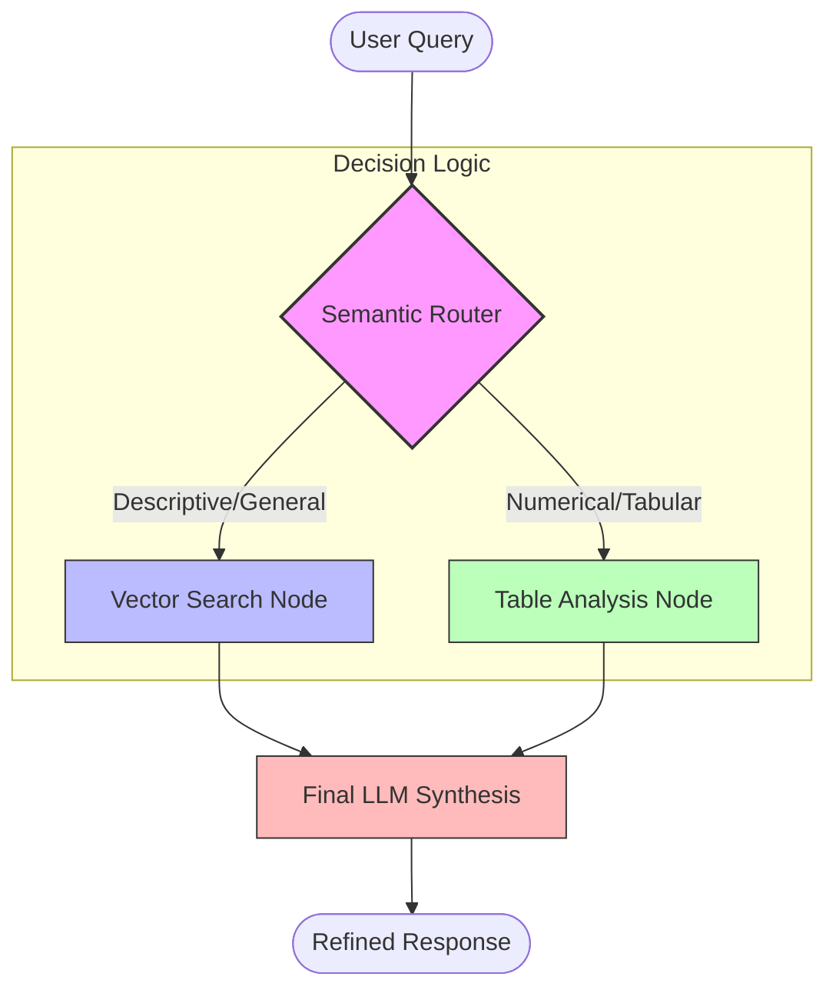

To make your `README.md` look professional and stand out on GitHub, you need to use clean Markdown formatting, structured headings, and visual diagrams.

Here is the exact code for your `README.md`. Copy the entire block below and paste it into your file:

```markdown
# 🛡️ Omni-Sentinel RAG
**An Agentic, Zero-Cost Retrieval System for Structured & Unstructured Data**

Omni-Sentinel is a production-grade **Agentic RAG** (Retrieval-Augmented Generation) pipeline designed to bridge the gap between semantic text search and structured data analysis. Built on a **Directed Acyclic Graph (DAG)** architecture, it ensures that your AI always uses the right tool for the job.

---

## 🏗️ System Architecture

Omni-Sentinel uses an **Agentic Router** to classify user intent before initiating retrieval. This prevents "context clutter" and ensures high-fidelity responses for both descriptive and numerical queries.

### High-Level Workflow


---

## 🌟 Key Technical Features

* **Agentic Orchestration:** Powered by **LangGraph**, the system manages state transitions deterministically, moving beyond brittle linear chains.
* **Local-First (Zero Cost):** Leverages **Ollama (Llama 3)** and **nomic-embed-text** for 100% private, free inference—no OpenAI/Pinecone credits required.
* **Hybrid Retrieval:** Automatically switches between specialized nodes:
* **Vector Node:** Handles high-dimensional semantic search for general documentation.
* **Table Node:** Extracts and parses Markdown tables to prevent numerical hallucinations.


* **High-Performance Infrastructure:** Managed with **uv**, achieving 10x faster environment resolution and reproducible builds.

---

## 🛠️ Tech Stack

| Component | Technology |
| --- | --- |
| **Language** | Python 3.12 |
| **Orchestration** | [LangGraph](https://www.langchain.com/langgraph) |
| **Environment** | [uv](https://docs.astral.sh/uv/) |
| **Local LLM** | [Ollama](https://ollama.com/) (Llama 3) |
| **Tracing** | Console-based State Logging |

---

## 🚀 Getting Started

### 1. Prerequisites

Install [Ollama](https://ollama.com/) and [uv](https://docs.astral.sh/uv/). Then pull the models:

```bash
ollama pull llama3
ollama pull nomic-embed-text

```

### 2. Installation & Execution

```bash
# Clone the repo
git clone [https://github.com/yourusername/omni-sentinel-rag](https://github.com/yourusername/omni-sentinel-rag)
cd omni-sentinel-rag

# Run the system (uv auto-installs deps)
uv run app.py

```

---

## 📊 Performance & Testing

The system was validated against two distinct query types to prove the routing logic:

| Query Type | Input Example | Routed Path | Result |
| --- | --- | --- | --- |
| **Qualitative** | "What is Omni-Sentinel?" | `vector_path` | Semantic Description |
| **Quantitative** | "What was the Q4 revenue?" | `table_path` | Precise Tabular Data |

