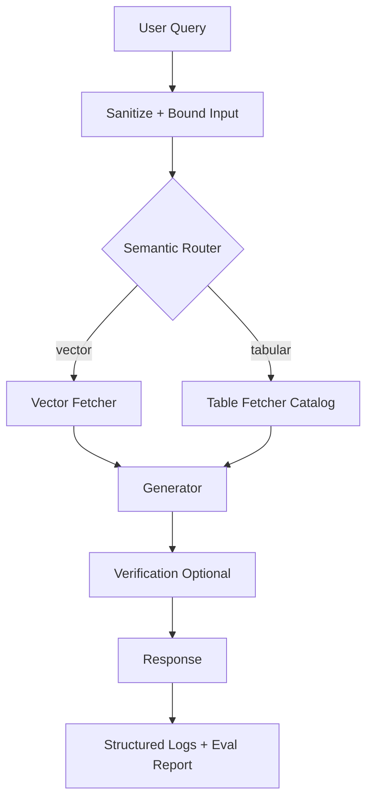

# Omni-Sentinel RAG

Omni-Sentinel is a local-first, production-oriented agentic RAG system that routes user queries through a graph-based workflow.

The project is optimized for:
- deterministic routing behavior
- secure local execution with LM Studio
- production observability and regression gating
- plug-and-play feature flags without breaking baseline behavior

## What This Project Does

1. Classifies user intent (semantic vs numeric/tabular).
2. Selects the matching retrieval path.
3. Synthesizes a final response with optional quality and guardrail layers.
4. Exposes both CLI and API surfaces for development and deployment.

## Data Source Model

This project now uses file-backed synthetic data by default:

1. Semantic context file: `docs/company_overview.txt`
2. Tabular context catalog:
    - `data/revenue.csv`
    - `data/incidents.csv`
    - `data/customers.csv`

Synthetic data currently includes:

- Rich company narrative context (products, pricing, compliance, KPIs, roadmap)
- Multi-year quarterly revenue rows (2022 to 2025)
- Multi-year incident operations dataset (`critical_incidents`, `p1_mtta_min`, `p1_mttr_min`)
- Customer segment dataset (`active_customers`, `new_logos`, `churn_rate_pct`, `nps_score`)
- Additional business metrics (`new_customers`, `renewal_rate_pct`, `operating_margin_pct`, `support_sla_pct`)

The graph stays unchanged. Only the fetchers read from files instead of hardcoded strings.

You can safely replace these files with your own company-approved datasets later.

## Architecture

### ASCII Component Diagram

```text
+------------------+        +-------------------+        +----------------------+
|      Client      | -----> |  Query Sanitizer  | -----> |  Semantic Router     |
| (CLI / API / CI) |        | + Input Limits    |        | (vector | tabular)   |
+------------------+        +-------------------+        +----------+-----------+
                                                                                                                                         |
                                                                                                +--------------------+--------------------+
                                                                                                |                                         |
                                                                                                v                                         v
                                                                     +-----------------------+                 +-----------------------+
                                                                     |   Vector Fetch Node   |                 |   Table Fetch Node    |
                                                                     | company_overview.txt  |                 | revenue/incidents/    |
                                                                     |                       |                 | customers CSV catalog |
                                                                     +-----------+-----------+                 +-----------+-----------+
                                                                                             |                                         |
                                                                                             +-------------------+---------------------+
                                                                                                                                     |
                                                                                                                                     v
                                                                                                        +-------------------------------+
                                                                                                        | Generator (LM Studio Chat)    |
                                                                                                        | + Optional Guardrails         |
                                                                                                        | + Optional Verification       |
                                                                                                        +---------------+---------------+
                                                                                                                                        |
                                                                                                                                        v
                                                                                                        +-------------------------------+
                                                                                                        | Response + Metrics + Status   |
                                                                                                        +-------------------------------+
```

### ASCII Request Flow

```text
User Query
     |
     v
Sanitize -> route decision -> fetch context -> generate -> verify (optional)
     |             |                  |             |              |
     +-------------+------------------+-------------+--------------+
                                                                 structured logs (request_id, route, latency, status)
```

### Mermaid Flowchart


```mermaid
graph TD
        U[User Query] --> S[Sanitize + Bound Input]
        S --> R{Semantic Router}
        R -->|vector| V[Vector Fetcher]
    R -->|tabular| T[Table Fetcher Catalog]
        V --> G[Generator]
        T --> G
        G --> Q[Verification Optional]
        Q --> O[Response]
        O --> L[Structured Logs + Eval Report]
```

## Project Layout

```text
Omni-Sentinel-RAG/
    app.py                      # core graph, routing, logging, verification, security controls
    api.py                      # FastAPI wrapper
    main.py                     # CLI commands (run, health_check, smoke_test)
    baseline_prompts.json       # baseline test set
    data/                       # synthetic tabular files (CSV)
    data/revenue.csv            # synthetic finance metrics
    data/incidents.csv          # synthetic incident operations metrics
    data/customers.csv          # synthetic customer segment metrics
    .github/workflows/          # CI pipeline (regression + docs lint)
    docs/                       # documentation hub
    docs/company_overview.txt   # synthetic semantic context source
    .env.example                # runtime configuration template
    Dockerfile                  # containerized API runtime
```

## Setup

### Prerequisites

1. Python 3.12
2. LM Studio installed and running with a loaded model
3. uv installed

### Environment Configuration

Windows:

```bash
copy .env.example .env
```

Set required values in `.env`:

```text
LMSTUDIO_BASE_URL=http://127.0.0.1:1234/v1
LMSTUDIO_API_KEY=lm-studio
LMSTUDIO_MODEL=<your-loaded-model-id>
VECTOR_CONTEXT_FILE=docs/company_overview.txt
TABULAR_DATA_FILE=data/revenue.csv
TABULAR_DATA_FILES=data/revenue.csv,data/incidents.csv,data/customers.csv
```

### Install Dependencies

```bash
uv sync
```

## Running the Project

### CLI

```bash
uv run python main.py run --query "What was the Q4 revenue?"
uv run python main.py health_check
uv run python main.py smoke_test
```

### API

```bash
uv run uvicorn api:app --host 0.0.0.0 --port 8000
```

Endpoints:
- GET `/health`
- POST `/query`

Example:

```bash
curl -X POST http://127.0.0.1:8000/query \
    -H "Content-Type: application/json" \
    -d '{"query": "What was the Q4 revenue?"}'
```

### Container

```bash
docker build -t omni-sentinel-rag .
docker run -p 8000:8000 --env-file .env omni-sentinel-rag
```

## Feature Flags and Controls

### Quality and Tracing
- `ENABLE_VERIFY`
- `ENABLE_GUARDRAILS`
- `ENABLE_TRACING`
- `ENABLE_EVAL_STUB_LLM`

### Security and Operations
- `ENABLE_INPUT_SANITIZATION`
- `MAX_QUERY_CHARS`
- `ENABLE_LOG_REDACTION`
- `API_RATE_LIMIT_ENABLED`
- `API_RATE_LIMIT_REQUESTS`
- `API_RATE_LIMIT_WINDOW_SECONDS`

### Data Source Paths
- `VECTOR_CONTEXT_FILE`
- `TABULAR_DATA_FILE`
- `TABULAR_DATA_FILES` (preferred multi-table mode)

## Evaluation and CI

Run CI-like local regression:

```bash
uv run python main.py smoke_test \
    --route-only \
    --min-route-accuracy 100 \
    --min-success-rate 100 \
    --max-p95-ms 1000 \
    --report-file eval_report.json
```

CI pipeline in `.github/workflows/regression.yml` runs:
1. route regression smoke checks
2. docs lint for markdown quality

## Documentation Hub

Use the docs folder for complete operational and architectural documentation:

- `docs/README.md`
- `docs/ARCHITECTURE.md`
- `docs/RUNBOOK.md`
- `docs/MODEL_COMPATIBILITY.md`
- `docs/ONBOARDING_30MIN.md`
- `docs/INCIDENT_RESPONSE.md`
- `docs/SAMPLE_QUERIES.md`
- `data/README.md`

## Production Notes

1. Keep optional flags OFF by default to preserve baseline behavior.
2. Enable advanced modules incrementally and re-run smoke tests.
3. Always verify route accuracy and p95 latency after model or prompt changes.

